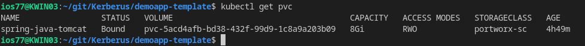
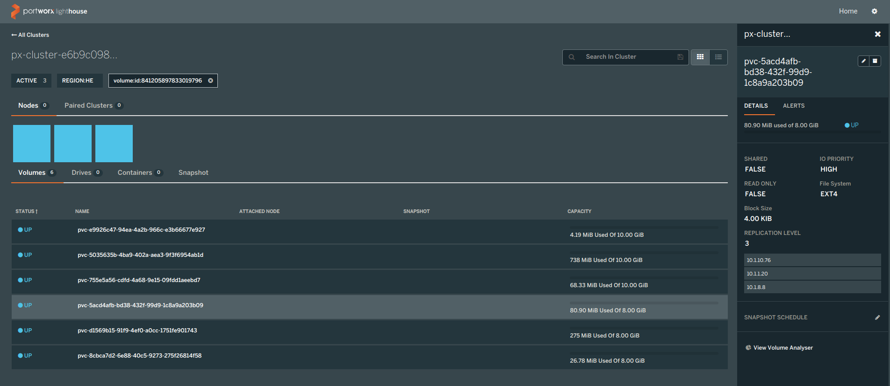
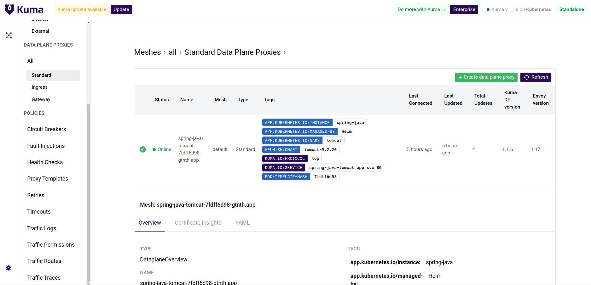
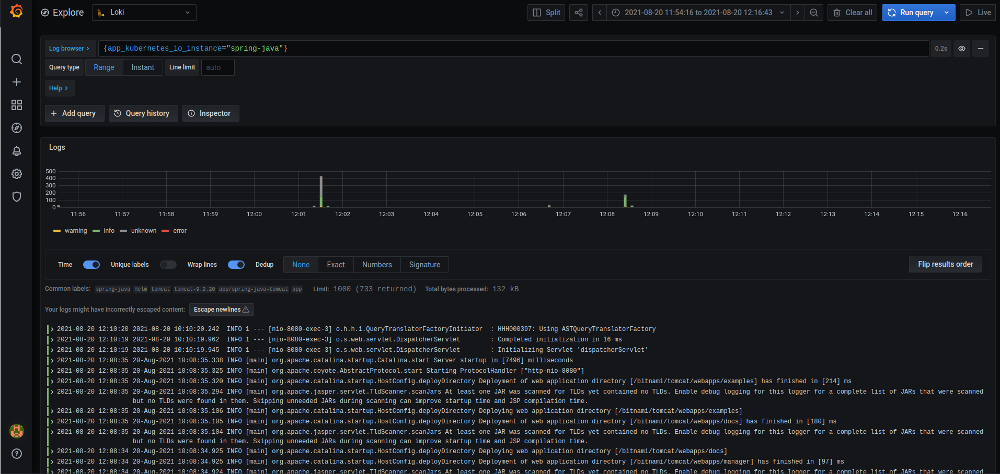

# Demo app

This repo contain the demo app.

## Application source code

For demo app starting point refer to [this](https://github.com/spring-guides/gs-accessing-data-mysql) and with changes explained [here](https://github.com/bitnami/tutorials/blob/master/spring-boot-app/README.md).

Further or Mysql compatibility the line is added in application.properties:

```java
spring.jpa.properties.hibernate.dialect=org.hibernate.dialect.MySQL8Dialect
```

Generate the WAR file by running the mvn package command. The resulting file will be located in target/gs-mysql-data-0.1.0.war.

## Docker Build

In the app-docker folder you find the Dockerfile containing:

```dockerfile
FROM bitnami/tomcat:9.0
COPY gs-mysql-data-0.1.0.war /opt/bitnami/tomcat/webapps_default/
```

Build:

```bash
docker build -t DOCKER_USERNAME/spring-java-app .
```

Push:

```bash
docker push DOCKER_USERNAME/spring-java-app:latest
```

Docker compose yaml for testing image:

```yaml
version: '2'

services:
    myapp:
    image: 'DOCKER_USERNAME/spring-java-app'
    environment:
      - 'SPRING_APPLICATION_JSON={"spring": {"datasource":{"url": "jdbc:mysql://mariadb:3306/db_example", "username": "springuser", "password": "ThePassword"}}}'
      - ALLOW_EMPTY_PASSWORD=yes
    depends_on:
      - mariadb
    ports:
     - '8080:8080
```

test:

```bash
docker compose-up
curl 'localhost:8080/gs-mysql-data-0.1.0/demo/all'
curl 'localhost:8080/gs-mysql-data-0.1.0/demo/add?name=First&email=someemail@someemailprovider.com'
curl 'localhost:8080/gs-mysql-data-0.1.0/demo/all'
```

## Helm chart

The hem chart in this repo is the result of

```bash
helm fetch bitnami/tomcat --untar
```

add the following part in _pod.tpl for allowing the composition of required env variable


```yaml
  - name: DBENDPOINT
    valueFrom:
      secretKeyRef:
        name: {{ .Values.mariadb.db.secretname }}
        key: endpoint
  - name: DBUSERNAME
    valueFrom:
      secretKeyRef:
        name: {{ .Values.mariadb.db.secretname }}
        key: username
  - name: DBNAME
    value:  {{ .Values.mariadb.db.dbname }}
  - name: DBPASSWD
    valueFrom:
      secretKeyRef:
        name: {{ .Values.mariadb.db.secretname }}
        key: password
  - name: SPRING_APPLICATION_JSON
    value: {{"'{\"spring\": {\"datasource\":{\"url\": \"jdbc:mysql://$(DBENDPOINT):3306/$(DBNAME)?useSSL=false\",\"username\": \"$(DBUSERNAME)\", \"password\": \"$(DBPASSWD)\"}}}'"}}
```

modify in values:

```yaml
image:
   registry: docker.io
   repository: DOCKER_USERNAME/spring-java-app
   tag: latest
```

add to values.yaml:

```yaml
mariadb:

  enabled: false
  replication:
    enabled: false
  db:
    secretname: mysqldb
    dbname: db_example
```

NB: secretname refer to [crossplane secrets](https://doc.crds.dev/github.com/crossplane/provider-gcp/database.gcp.crossplane.io/CloudSQLInstance/v1beta1@v0.17.1#spec-writeConnectionSecretToRef-name) for connection details.

Change in values.yaml for LoadBalancer to NodePort:

```yaml
service:
  ## @param service.type Kubernetes Service type
  ## For minikube, set this to NodePort, elsewhere use LoadBalancer
  ##
  type: NodePort
  ## @param service.port Service HTTP port
  ##
  port: 80
  ## @param service.nodePort Kubernetes http node port
  ## ref: https://kubernetes.io/docs/concepts/services-networking/service/#type-nodeport
  ##
  nodePort: "30080"
```

and for setting Kuma ingress with encryption:

```yaml
ingress:
  ## @param ingress.enabled Enable ingress controller resource
  ##
  enabled: true
  ## @param ingress.certManager Set this to true in order to add the corresponding annotations for cert-manager
  ##
  certManager: true
  ## @param ingress.hostname Default host for the ingress resource
  ##
  hostname: <HOSTNAME>
  ## @param ingress.annotations Ingress annotations
  ## For a full list of possible ingress annotations, please see
  ## ref: https://github.com/kubernetes/ingress-nginx/blob/master/docs/user-guide/nginx-configuration/annotations.md
  ##
  ## If certManager is set to true, annotation kubernetes.io/tls-acme: "true" will automatically be set
  ##
  annotations:
    kubernetes.io/ingress.class: "kong"
    cert-manager.io/cluster-issuer: <CLUSTER-ISSUER NAME>
  ## @param ingress.tls Enable TLS configuration for the hostname defined at `ingress.hostname` parameter
  ## TLS certificates will be retrieved from a TLS secret with name: {{- printf "%s-tls" .Values.ingress.hostname }}
  ## You can use the ingress.secrets parameter to create this TLS secret, relay on cert-manager to create it, or
  ## let the chart create self-signed certificates for you
  ##
  tls: true
```

For having the pod deployed and Joined to mesh the namespace in which you deploy must have this further annotation, see file kuma-dataplane.yaml in various directory:

```yaml
  annotations:
    kuma.io/sidecar-injection: enabled
    kuma.io/mesh: default"
```

run:

```bash
helm dependency update .
helm install -n app --create-namespace  spring-java .
```

test:

```html
https://<HOSTNAME>/gs-mysql-data-0.1.0/demo/add?name=First&email=someemail@someemailprovider.com
https://<HOSTNAME>/gs-mysql-data-0.1.0/demo/all
```

The result is the app deployed in the cluster using Porworx as storage:





The app has a valid ssl certificate exposed by the Kong ingress and registered in the Kuma mesh:



The application log is further availale in Grafana using Loki source:



## Old Notes for using with Mariadb

The add dependency in Chart.yaml (not in requirements fiels since in deprecated, changed to a more recent mariadb image (statesful api version error)):

```yaml
- name: mariadb
  version: 9.4.2
  repository: https://charts.bitnami.com/bitnami
  condition: mariadb.enabled
  tags:
    - spring-java-app-database
```

since this mariadb cannot receive values in dependency, untar mariadb under chart, add the required parameter to create the db, the user and passw:

```yaml
auth:
  database: db_example
  username: "springuser"
  password: "ThePassword"
```

add to _helpers.tpl

```yaml
{{/*
Create a default fully qualified app name.
We truncate at 63 chars because some Kubernetes name fields are limited to this (by the DNS naming spec).
*/}}
{{- define "mariadb.fullname" -}}
{{- printf "%s-%s" .Release.Name "mariadb" | trunc 63 | trimSuffix "-" -}}
{{- end -}}
```

create spring-secret.yaml in template directory:

```yaml
apiVersion: v1
kind: Secret
metadata:
  name: {{ template "tomcat.fullname" . }}-spring
  labels:
    app: {{ template "tomcat.fullname" . }}
    chart: "{{ .Chart.Name }}-{{ .Chart.Version }}"
    release: "{{ .Release.Name }}"
    heritage: "{{ .Release.Service }}"
type: Opaque
data:
  spring-db: {{ printf "{\"spring\": {\"datasource\":{\"url\": \"jdbc:mysql://%s:3306/%s\", \"username\": \"%s\", \"password\": \"%s\"}}}" (include "mariadb.fullname" .) .Values.mariadb.db.name .Values.mariadb.db.user .Values.mariadb.db.password | b64enc }}
```

add to _pod.tpl

```yaml
 - name: SPRING_APPLICATION_JSON
    valueFrom:
      secretKeyRef:
        name: {{ template "common.names.fullname" . }}-spring
        key: spring-db
```